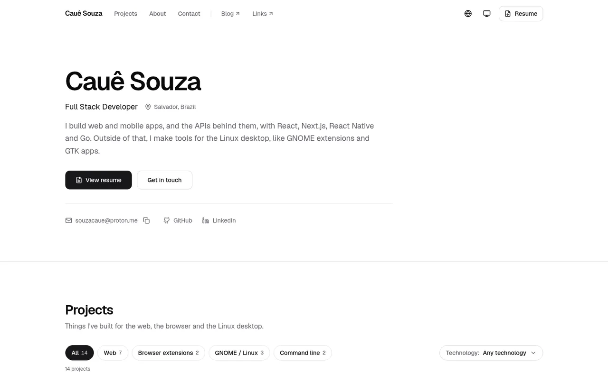
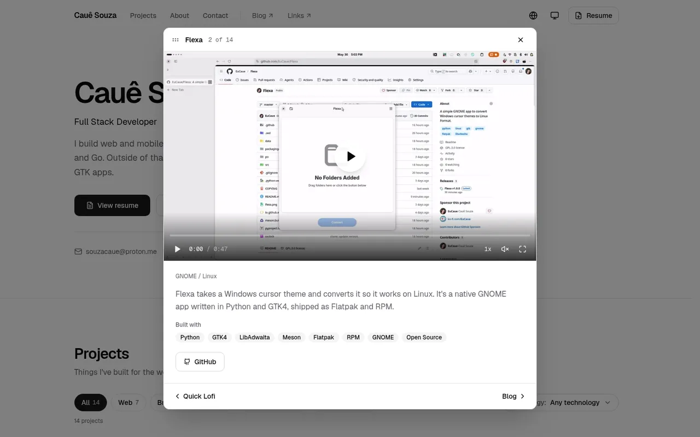

<div align="center">

# Cauê Souza

**Portfolio of a full stack developer from Salvador, Brazil.**

[portfolio.eucaue.online](https://portfolio.eucaue.online) &nbsp;·&nbsp; [blog](https://blog.eucaue.online) &nbsp;·&nbsp; [links](https://eucaue.online)

<br />

[](https://nextjs.org) [](https://react.dev) [](https://www.typescriptlang.org) [](https://tailwindcss.com) [](https://portfolio.eucaue.online)

<br />

<picture>
  <source media="(prefers-color-scheme: dark)" srcset="docs/readme/hero-dark.webp" />
  
</picture>

</div>

<br />

My portfolio. It lists the things I've shipped, from web and mobile apps to GNOME extensions and GTK tools, and keeps the resume and a way to reach me one click away from anywhere on the page.

The look stays quiet on purpose: neutral grays, one typeface, and the projects doing the talking.

## What's worth a look

| | How it works | Where |
| --- | --- | --- |
| **State lives in the URL** | Filters, the open project and the resume preview are query params (`?platform=gnome&tech=Python`, `?project=flexa`, `?resume=open`). Links can be shared, and Back closes whatever was opened. Writes go through the History API, so nothing waits on the server. | [`url-state.ts`](src/lib/url-state.ts), [`use-url-state.ts`](src/hooks/use-url-state.ts) |
| **Project dialog** | Every project opens in a dialog with its video, gif or screenshot. On wider screens you can drag it around by the header, and the arrows walk through the list. | [`project-dialog.tsx`](src/components/portfolio/project-dialog.tsx) |
| **Video player** | Demo videos use a small custom player on top of `<video>`: seek, speed, mute and fullscreen, all reachable from the keyboard. | [`video-player.tsx`](src/components/portfolio/video-player.tsx) |
| **Resume preview** | The PDF comes from Vercel Blob through a route, previews in a dialog, and `?download=1` hands back an attachment. Switching between English and Portuguese happens inside the dialog. | [`route.ts`](src/app/api/resume/[lang]/route.ts), [`resume-dialog.tsx`](src/components/portfolio/resume-dialog.tsx) |
| **Latest posts** | Pulled from the blog's RSS feed at build time and refreshed once a day. The parser has no dependencies, and the section hides itself when the feed is empty. | [`blog.ts`](src/lib/blog.ts), [`rss.ts`](src/lib/rss.ts) |
| **Two languages** | `/en` and `/pt-br`, picked from a cookie or the browser on the first visit. Every string sits in one file per language. | [`middleware.ts`](src/middleware.ts), [`locales/`](src/locales) |
| **The fun bits** | A toolbox you can flick through card by card, a pointer glow and a count-up on Quick Lofi, and a preview that trails the cursor over "More projects". Adapted from [React Bits](https://reactbits.dev). | [`react-bits/`](src/components/react-bits), [`hover-preview-list.tsx`](src/components/portfolio/hover-preview-list.tsx) |

Motion respects `prefers-reduced-motion`, focus is always visible, and the theme menu follows the system unless you pick light or dark yourself.

<br />

<div align="center">
<picture>
  <source media="(prefers-color-scheme: dark)" srcset="docs/readme/dialog-dark.webp" />
  
</picture>
</div>

<br />

## Stack

| Layer | Choice |
| --- | --- |
| Framework | Next.js 15 (App Router, static pages with daily revalidation) |
| UI | React 19, Tailwind CSS 3, Radix primitives in the shadcn/ui style |
| Motion | framer-motion, plus CSS scroll-driven animations where they're enough |
| Icons and type | lucide-react, Geist and Geist Mono through `next/font` |
| Theme | next-themes |
| Contact form | EmailJS |
| Files | Vercel Blob for the resume PDFs |
| Tooling | Bun, Biome, `bun test` |

## Running it

You'll need [Bun](https://bun.sh).

```bash
bun install
bun dev
```

The site opens at `http://localhost:3000` and redirects to `/en` or `/pt-br`.

Create a `.env.local` with the values below. The site still runs without them: the contact form just won't send, and the resume route shows a fallback page instead of the PDF.

| Variable | What it's for |
| --- | --- |
| `NEXT_PUBLIC_EMAILJS_SERVICE_ID` | EmailJS service for the contact form |
| `NEXT_PUBLIC_EMAILJS_TEMPLATE_ID` | EmailJS template |
| `NEXT_PUBLIC_EMAILJS_PUBLIC_KEY` | EmailJS public key |
| `BLOB_READ_WRITE_TOKEN` | Read access to the Vercel Blob store with the resumes |
| `BLOG_URL` | Optional. Points "Latest posts" at another blog, like a local one at `http://localhost:4321` |

The checks:

```bash
bun test            # URL state, filters, RSS parsing, copy rules
bun run lint        # Biome
bunx tsc --noEmit   # types
```

The copy tests fail if a string uses an em dash, if a Portuguese key goes missing, or if a sentence slips into stock phrases that sound machine written.

## Making changes

**Adding a project.** Add an entry to [`src/data/projects.ts`](src/data/projects.ts) with its platform, tags and links, then add the title and description keys to both [`en.ts`](src/locales/en.ts) and [`pt-BR.ts`](src/locales/pt-BR.ts). Videos go in `public/` with a poster in `public/posters/`. Set `featured` to put it in the top grid.

**Updating the resume.** Upload the PDF to the Blob store as `resume/CAUE-SOUZA-RESUME-EN.pdf` or `resume/CAUE-SOUZA-RESUME-PT.pdf`. The route always serves the newest upload, so no deploy is needed.

**Changing the text.** It's all in [`src/locales`](src/locales). Keep both languages in step, or `bun test` will complain.

## How the repo is laid out

```text
src/
├── app/
│   ├── [locale]/          pages, layout, metadata and the share image
│   └── api/resume/        serves the resume PDFs from Blob
├── components/
│   ├── sections/          intro, projects, about, latest posts, contact
│   ├── portfolio/         project cards, dialog, player, resume preview
│   ├── react-bits/        adapted React Bits components
│   ├── common/            navbar, theme and language menus
│   └── ui/                shadcn/ui primitives
├── data/                  projects and skills
├── hooks/                 URL state, media queries, reduced motion
├── lib/                   pure logic, each file with its own tests
└── locales/               English and Portuguese copy
```

## Deploying

Vercel builds every push. `master` goes to [portfolio.eucaue.online](https://portfolio.eucaue.online) and other branches get preview URLs.

<br />

<div align="center">
<sub>
Made in Salvador by Cauê Souza &nbsp;·&nbsp; <a href="mailto:souzacaue@proton.me">souzacaue@proton.me</a> &nbsp;·&nbsp; <a href="https://github.com/EuCaue">GitHub</a> &nbsp;·&nbsp; <a href="https://linkedin.com/in/caue-souza">LinkedIn</a>
</sub>
</div>
